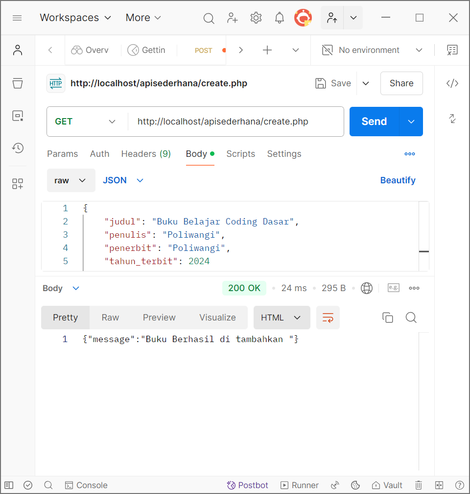
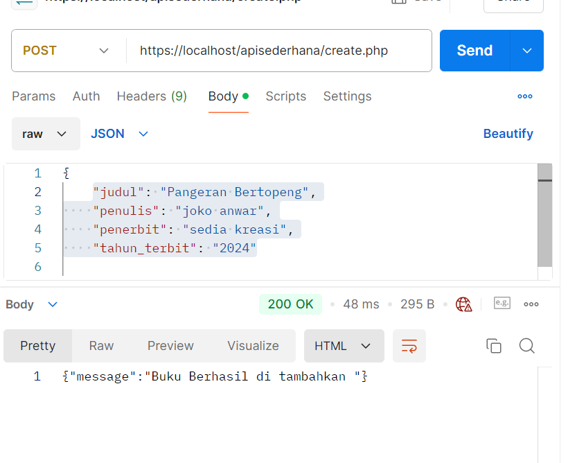
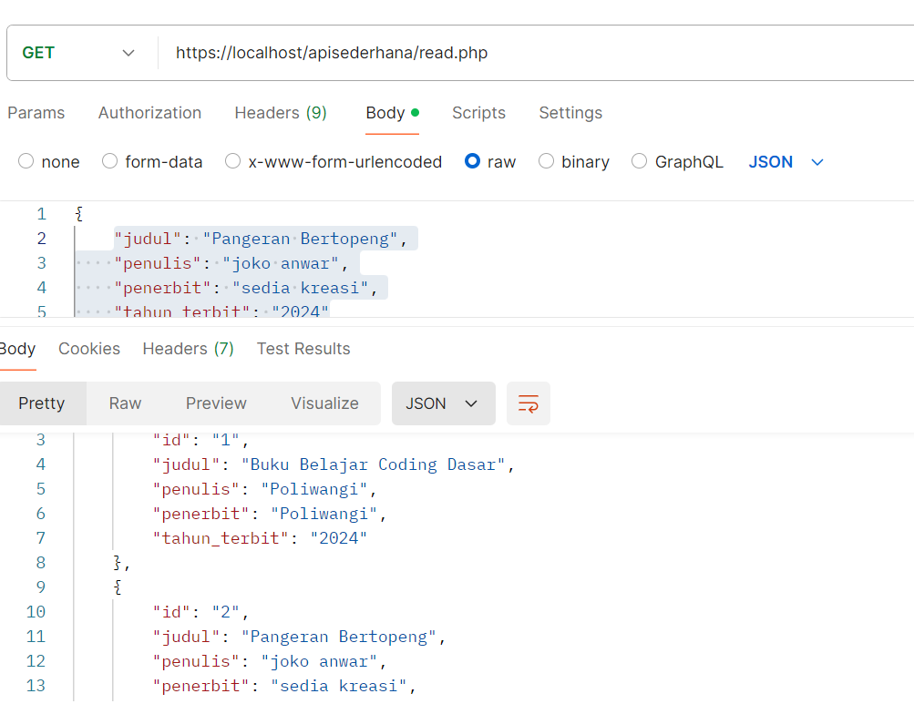
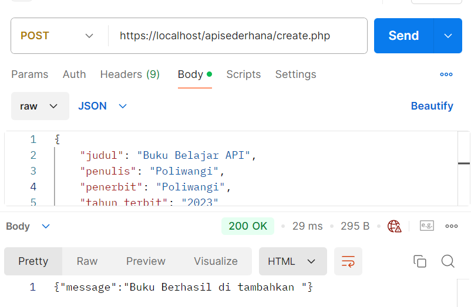
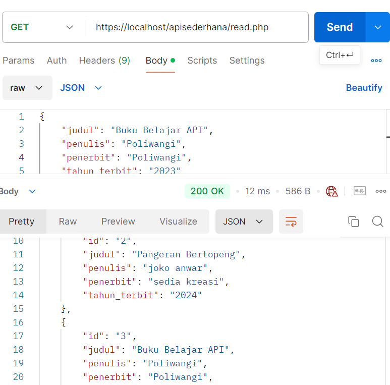
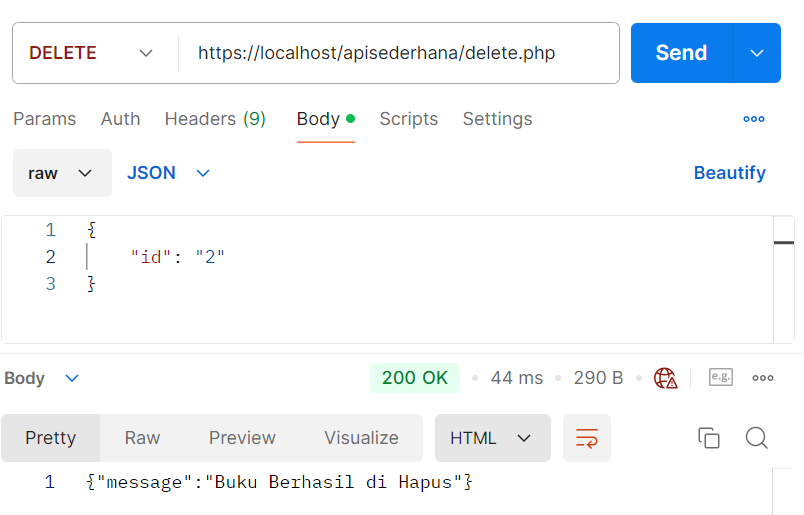

Praktikum:
1.Get untuk menampilkan data:

2.Post untuk menambahkan data:

3.Get untuk menampilkan semua data yang telah ditambahkan:

4.Post untuk menambahkan data:

5.Get untuk menampilkan semua data yang telah ditambahkan:

6.Delete untuk menghapus data berdasarkan id 1

